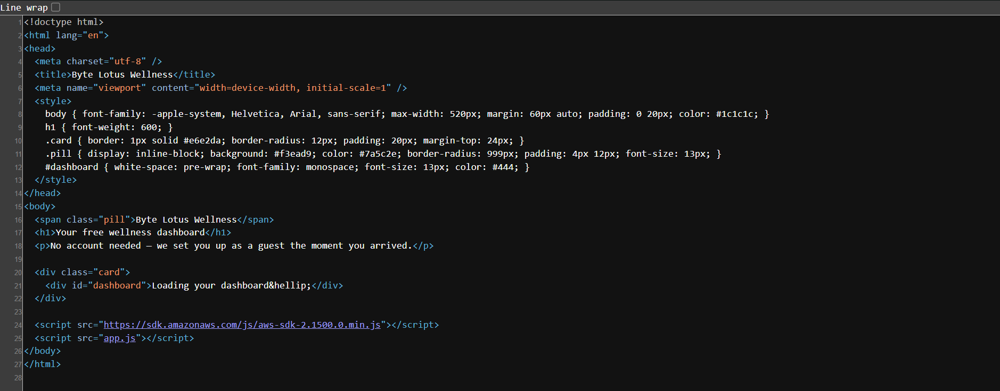
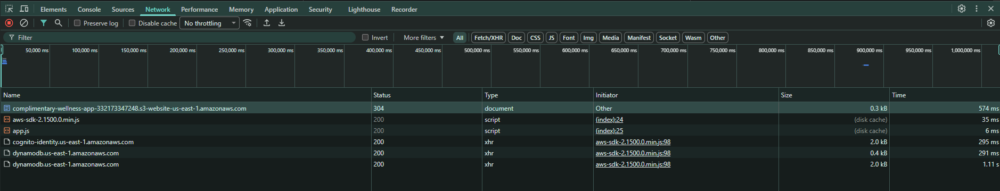
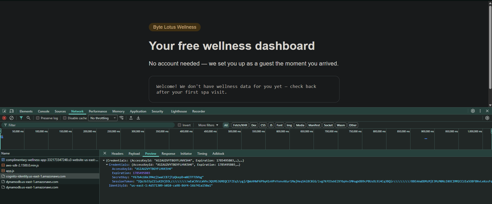
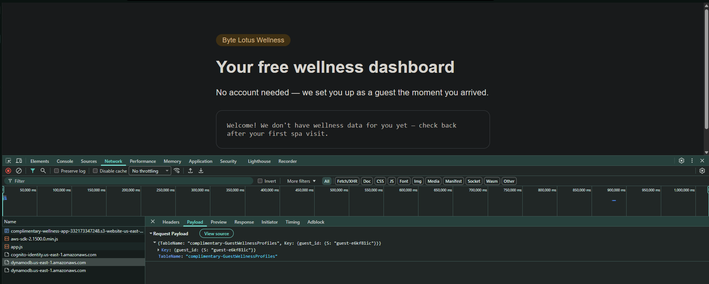
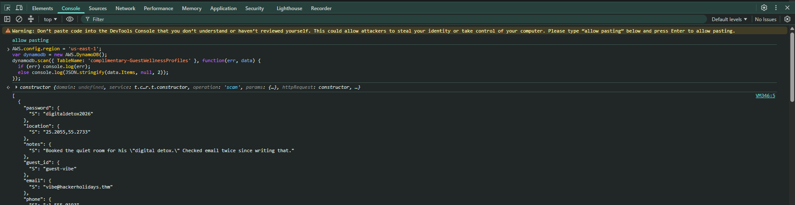
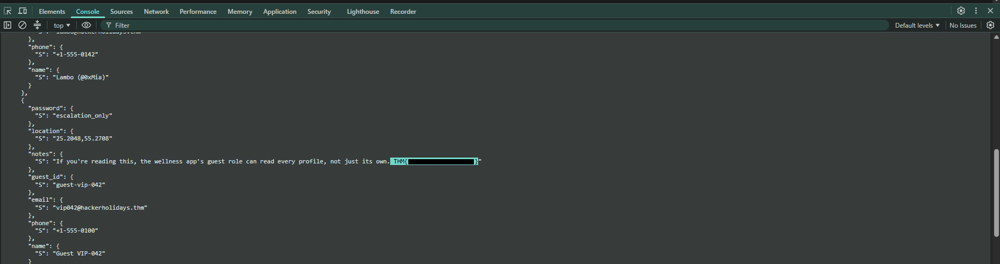

### TryHackMe — Complimentary Writeup

Executive Summary:

- **Platform:** TryHackMe
- **Room:** Complimentary
- **Category:** Cloud Security
- **Difficulty:** Easy

The **Complimentary** challenge demonstrates a common cloud misconfiguration vulnerability involving hardcoded or publicly exposed temporary AWS credentials via Amazon Cognito. By leveraging these exposed credentials, an attacker can query the backend Amazon DynamoDB instance directly and retrieve sensitive guest data stored within the database.

### Initial Reconnaissance & Inspection

Navigate to the target web application hosted on AWS S3:
```text
http://complimentary-wellness-app-332173347248.s3-website-us-east-1.amazonaws.com/
```


Inspect the HTML source code (`View Page Source`) to check for developer comments or hardcoded sensitive variables. No significant comments are present in the source.




### Network Traffic & Credential Enumeration

Open Browser Developer Tools (**F12** or **Inspect**) and navigate to the **Network** tab.



Refresh the page to capture initial API interactions and script loadings.

Analyze the outgoing API requests and responses:

- **Cognito Credentials Leak:** Look at responses returning authorization tokens or identity credentials. The web application retrieves temporary AWS credentials (`AccessKeyId`, `SecretKey`, and `SessionToken`) issued by **AWS Cognito**.




- **Target Database Discovery:** Inspect API request payloads to determine backend storage details. The app attempts to fetch records from an AWS DynamoDB table named `complimentary-GuestWellnessProfiles` using a query key of `guest_id`.




### Exploitation & Data Exfiltration

Because the application imports the AWS JavaScript SDK and exposes temporary credentials to the client side, we can interact directly with the DynamoDB service from the browser console.

Switch to the **Console** tab in Developer Tools. Execute the following JavaScript script to perform a full DynamoDB `scan` operation, bypassing single-item query restrictions:

```JavaScript
AWS.config.region = 'us-east-1';  
var dynamodb = new AWS.DynamoDB();  
dynamodb.scan({ TableName: 'complimentary-GuestWellnessProfiles' }, function(err, data) {  
  if (err) {  
    console.log(err);  
  } else {  
    console.log(JSON.stringify(data.Items, null, 2));  
  }  
});
```
Enable pasting by running ‘allow pasting’.



running the script

Review the returned JSON output containing all guest wellness records stored in the database. Inside the JSON response payload, locate the item containing the challenge flag:

