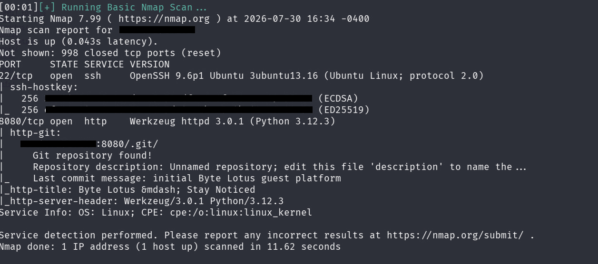
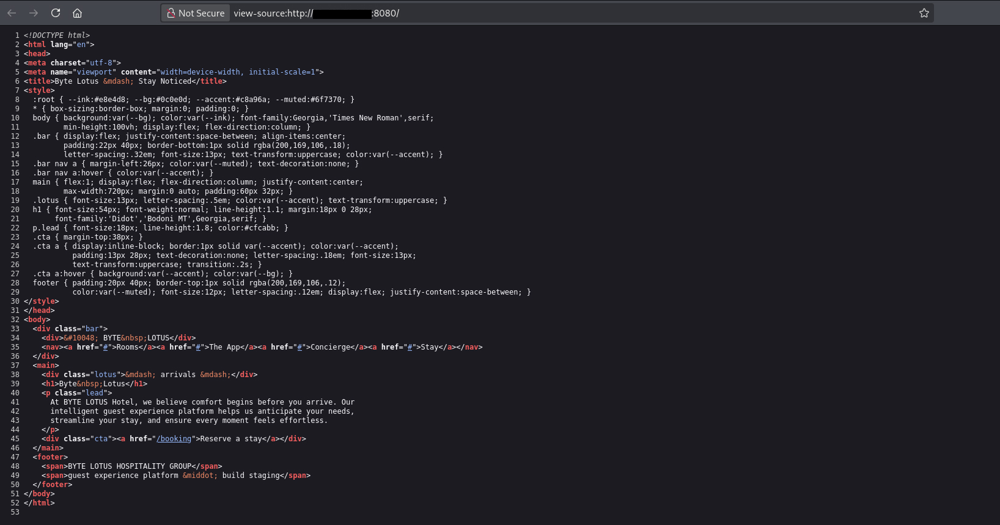
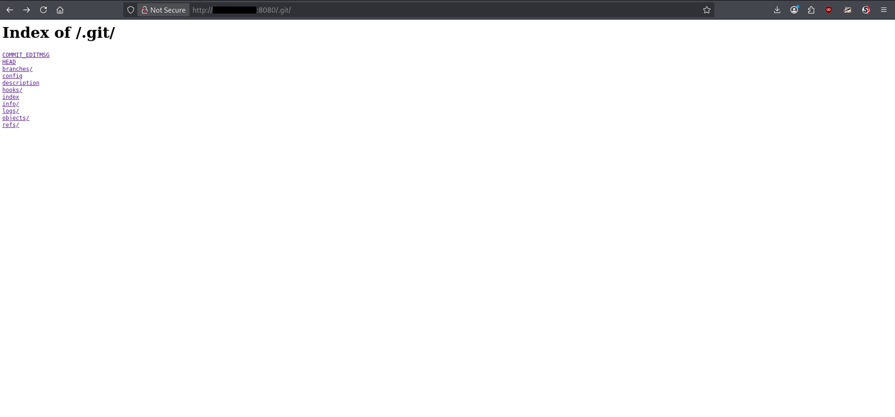
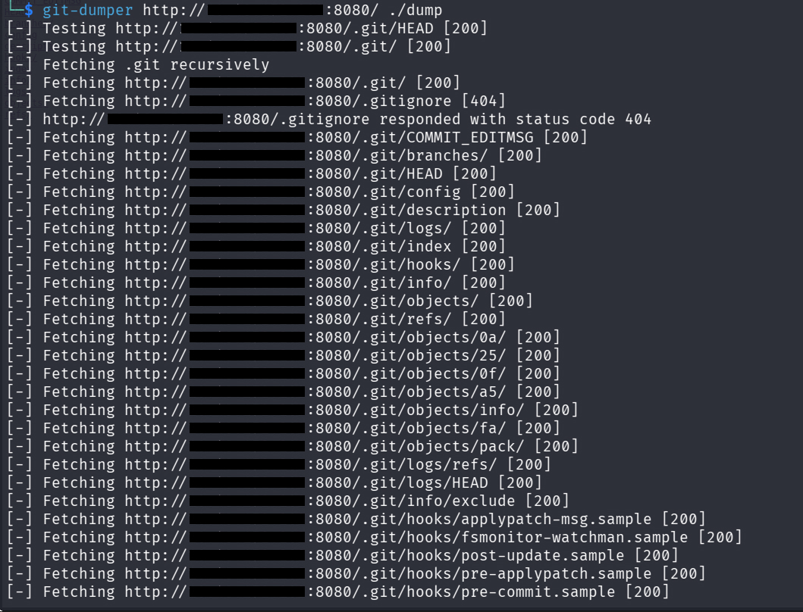
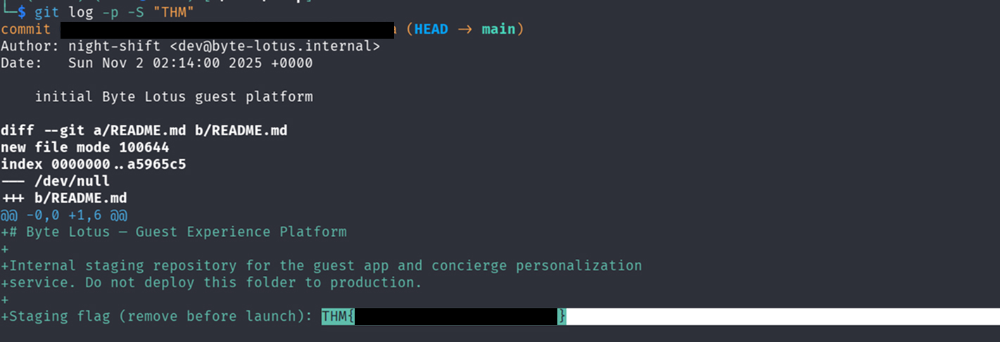

## Executive Summary
- **Room :** Room 404
- **Platform:** TryHackMe
- **Difficulty:** Easy
- **Category:** Web/Directory Enumeration

The **Room 404** challenge demonstrates the security risks associated with exposing version control metadata on public web servers. By conducting network scanning and web enumeration, an exposed `.git` directory was identified on port `8080`. Using automated Git dumping tools, the full source code repository was recovered locally. Analyzing the commit history and patch logs revealed sensitive sensitive information, directly leading to flag retrieval.

## Enumeration

### Reconnaissance & Port Scanning

Initial discovery begins with an aggressive Nmap scan to enumerate running services, versions, and standard scripts on the target machine.

```
nmap -sV -sC <TARGET_IP>
```



**Key Findings:**
- **SSH** is running on standard ports.
- **HTTP / Web Server** is active on port `8080`.
- Nmap default scripts identified the presence of an accessible **Git repository** hosted on the web root.

### Web Enumeration & Git Exposure Verification

Inspecting the main web application on port `8080` showed standard web content. Checking the raw HTML source code revealed no hidden developer comments.



To confirm whether the `.git` metadata folder was directly accessible via the web server, a `curl` request was sent to the `.git/` endpoint:


```
curl http://<TARGET_IP>:8080/.git/
```

The server responded with an HTTP status indicating directory access, confirming that the Git repository directory was publicly reachable.



### Source Code Dumping

Because the `.git` directory structure was fully exposed, the entire repository history could be recreated locally using `git-dumper`.

1. **Install `git-dumper`** (if not already present):

```
pip install git-dumper
```

2. **Dump the remote repository:**


```
git-dumper http://<TARGET_IP>:8080/ ./dump
```



This command pulls down all objects, branches, and commit histories from the remote web server into a local directory named `./dump`.

### Git Log Analysis & Flag Retrieval

Once the repository content is extracted, navigate into the local repository directory:


```
cd dump
```

To review previous changes, commits, and deleted or modified code snippets where sensitive data might reside, inspect the commit history along with patch diffs using `git log`:

```
git log -p -S "THM"
```

Reviewing the detailed patch history (`-p`) displays the diffs introduced across previous commits, revealing the hidden flag embedded inside the commit history.


