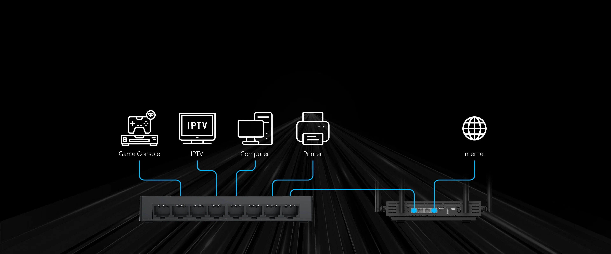
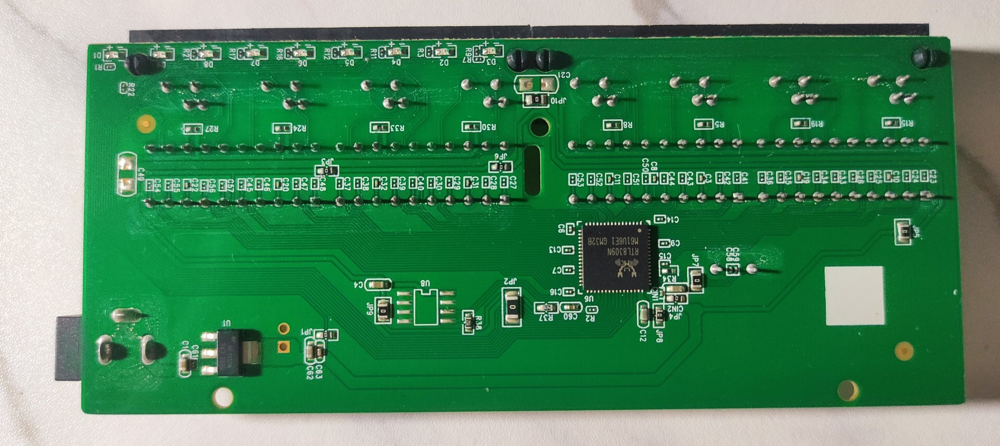
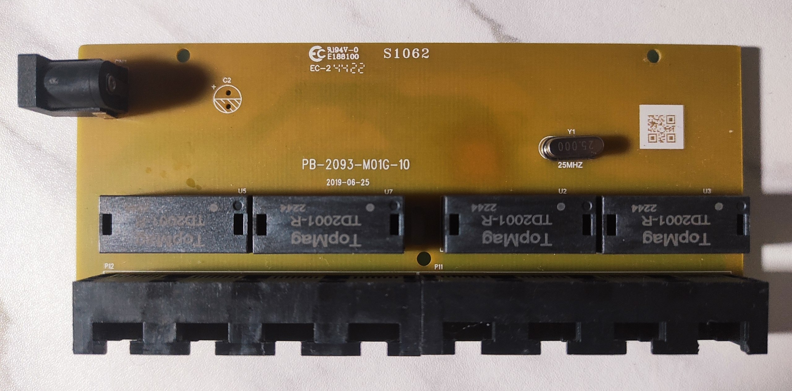
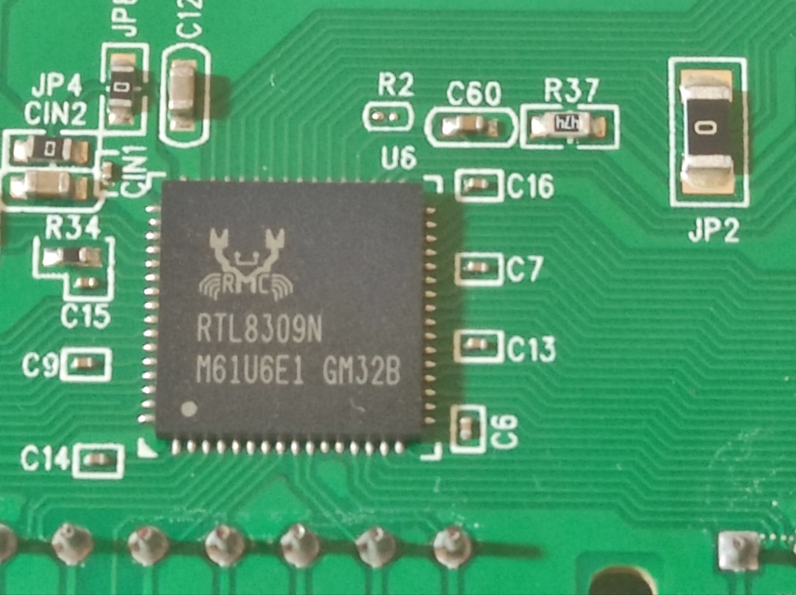
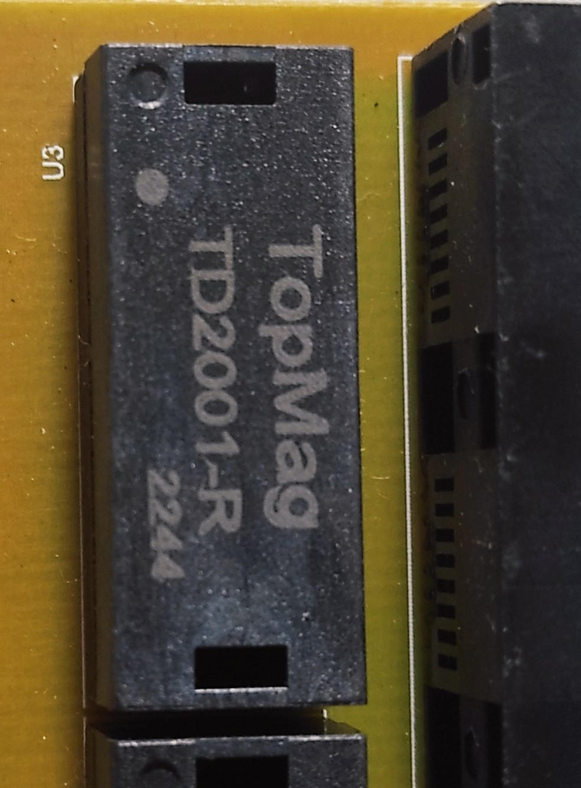
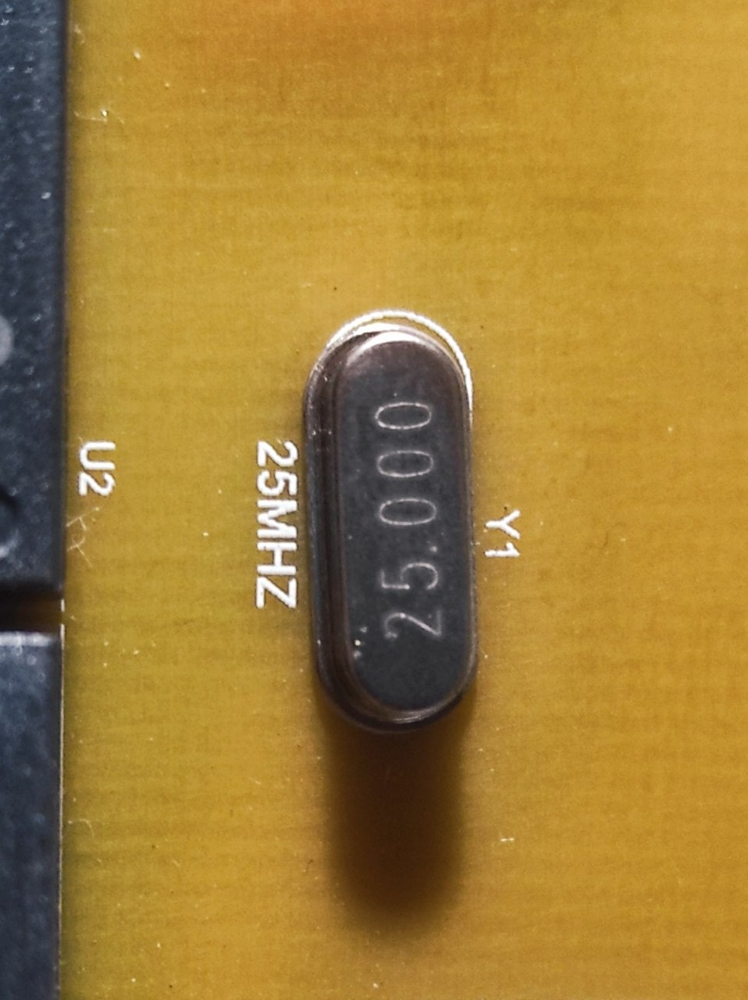
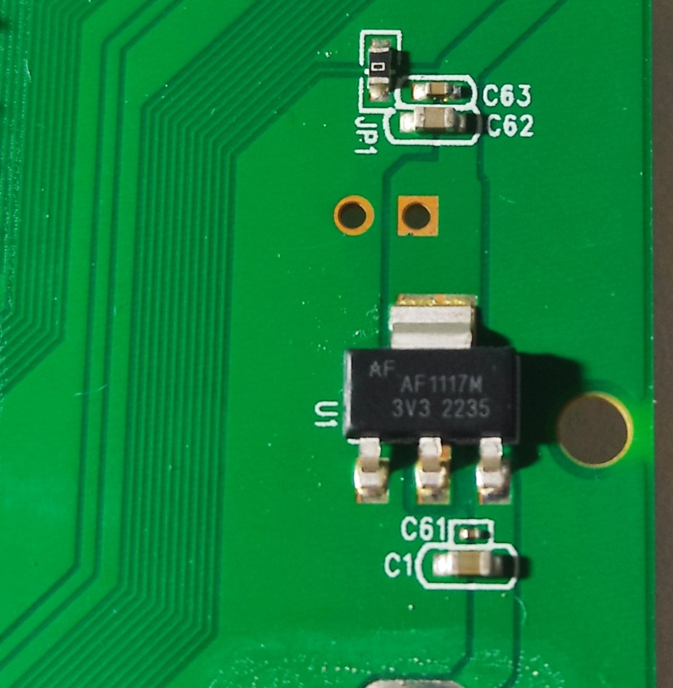
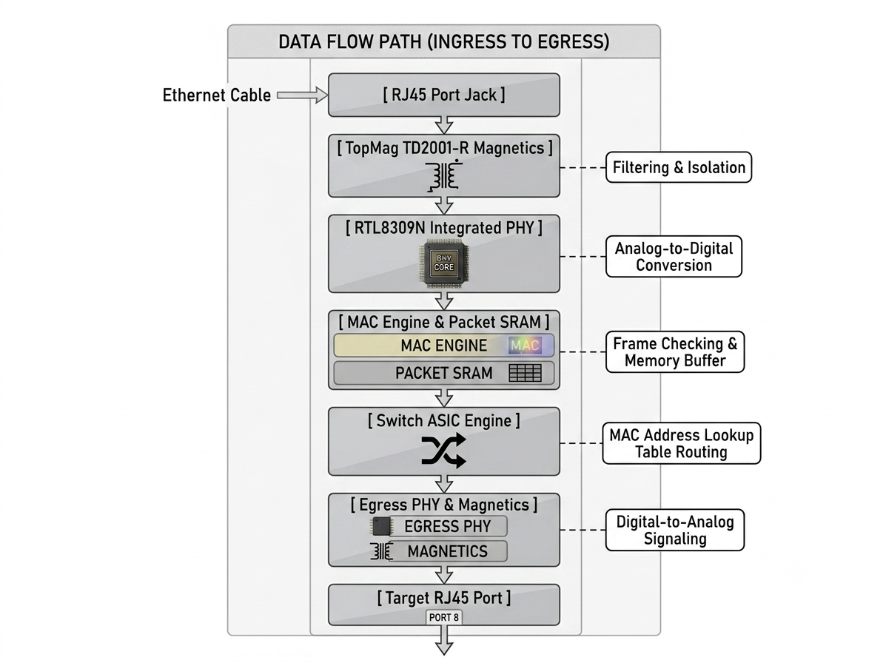

I've been digging through my hardware component bag and found a used Netis Ethernet switch. I was curious about what's inside and how it works, so I tore it open and did some research to see what component is doing what. After hours of searching, I found gold.

Unmanaged Fast Ethernet switches are often treated as simple black boxes in networking- plug in power, attach Ethernet cables, and traffic routes seamlessly across devices. To understand how this budget-friendly device operates at the silicon level, I took a screwdriver to my Netis ST3108C 8-Port 10/100M Fast Ethernet Switch to map out its hardware architecture, trace how its internal components handle data, and extract key insights for hardware enthusiasts and security researchers.

Here is a hardware breakdown of what exists inside the enclosure, how the circuit components route data, and key takeaways for hardware enthusiasts and security researchers.
## Table of Contents

- [Table of Contents](#table-of-contents)
- [1. Device Overview \& Specifications](#1-device-overview--specifications)
- [2. Hardware Architecture \& Key Silicon Components](#2-hardware-architecture--key-silicon-components)
  - [A. The Brain: Realtek RTL8309N Switch Controller](#a-the-brain-realtek-rtl8309n-switch-controller)
  - [B. Signal Isolation: TopMag TD2001-R Magnetic Modules](#b-signal-isolation-topmag-td2001-r-magnetic-modules)
  - [C. Timing Reference: 25.000 MHz Crystal Oscillator](#c-timing-reference-25000-mhz-crystal-oscillator)
  - [D. Power Management: AF1117M 3.3V Low-Dropout Regulator](#d-power-management-af1117m-33v-low-dropout-regulator)
- [3. Step-by-Step Data Path: How a Frame Moves Through the Switch](#3-step-by-step-data-path-how-a-frame-moves-through-the-switch)
- [4. Hardware Security \& Research Takeaways](#4-hardware-security--research-takeaways)
- [Conclusion](#conclusion)

## 1. Device Overview & Specifications

The Netis ST3108C is an unmanaged SOHO (Small Office/Home Office) desktop switch designed for zero-configuration plug-and-play operation.

- **Brand / Model:** [Netis ST3108C](https://www.netis-systems.com/business/ST3108C.html)
- **Form Factor:** Plastic casing, fanless, wall-mountable
- **Power Input:** DC 5V ⎓ 600mA
- **Port Configuration:** 8 × RJ45 ports (10/100 Mbps, Auto-Negotiation, Auto MDI/MDIX) 

## 2. Hardware Architecture & Key Silicon Components

Once the outer casing is removed, the device consists of a single PCB (Board ID: `PB-2093-M01G-10`, dated `2019-06-25`). The components are split cleanly between the top side (yellow dielectric coating) and bottom side (green solder mask layer).

  
### A. The Brain: Realtek RTL8309N Switch Controller

- **Designator:** `U6` 
- **Role:** Single-Chip 8-Port 10/100M Fast Ethernet Switch Controller

At the center of the green PCB side sits the **Realtek RTL8309N**. In unmanaged switches, this single System-on-Chip (SoC) handles almost every Layer-2 responsibility:
- **Embedded PHY & MAC:** It integrates 8 Physical Layer (PHY) transceivers and 8 Media Access Control (MAC) engines onto a single silicon die.

- **Packet Switching & SRAM:** The chip contains built-in packet buffer memory to store frames during high network contention.

- **Lookup Table:** It manages an internal MAC address table, mapping hardware addresses to physical ports using auto-learning and aging algorithms.

- **Green Ethernet Power Savings:** It automatically detects cable length and link status, scaling power delivery up or down per port.

### B. Signal Isolation: TopMag TD2001-R Magnetic Modules

- **Designators:** `U2`, `U3`, `U5`, `U7`
- **Role:** Pulse Transformers / Magnetics Filters

Positioned directly behind the 8 RJ45 ports on the top side of the board are four dual-channel **TopMag TD2001-R** modules. Ethernet magnetics serve three vital physical functions:

  

1. **Galvanic Isolation:** Isolates the internal digital silicon from high-voltage transients or static discharges on external Ethernet cables.

2. **Common Mode Noise Suppression:** Filters out electromagnetic interference (EMI) to maintain signal integrity over copper wire pairs.

3. **Impedance Matching:** Ensures smooth differential signaling between line wires and internal PHY circuits.

### C. Timing Reference: 25.000 MHz Crystal Oscillator

- **Designator:** `Y1`
- **Role:** System Clock Reference

Located on the top side, this metal-can crystal oscillator vibrates at exactly **25 MHz**. The Realtek RTL8309N relies on this precise frequency to generate the internal clocks required for 10BASE-T and 100BASE-TX line timing, framing, and packet processing.

  

### D. Power Management: AF1117M 3.3V Low-Dropout Regulator

- **Designator:** `U1`
- **Role:** Linear Voltage Step-Down

The switch accepts a DC 5V barrel input. Because high-density digital ICs require lower, regulated voltages, the **AF1117M 3V3** LDO steps down the incoming 5V line to a stable 3.3V rail to supply the RTL8309N core and peripheral circuitry (`C61`, `C62`, `C63` capacitors handle ripple filtering).

## 3. Step-by-Step Data Path: How a Frame Moves Through the Switch

When a device on Port 1 sends a frame to a device on Port 8, the signal follows a defined physical path across the board:

1. **Physical Reception:** The incoming differential analog signals pass through the RJ45 pins into the **TopMag TD2001-R** transformers. 
2. **PHY Conversion:** The integrated PHY inside the **RTL8309N** decodes the analog signal into digital data streams.  
3. **MAC Layer Processing:** The MAC engine checks the Ethernet frame's Cyclic Redundancy Check (CRC) for corruption and extracts the Source and Destination MAC addresses.
4. **Switching Lookup:** The switch ASIC checks its internal memory table. If the destination MAC is known, it routes the frame directly to the target port's egress buffer. If unknown or broadcast, it floods the frame to all active ports except the sender.
5. **Egress Transmission:** The target port’s PHY converts the frame back into analog differential signals, passing through magnetics onto the copper cable.

## 4. Hardware Security & Research Takeaways

From a cybersecurity and hardware analysis perspective, unmanaged switches offer several interesting insights:

- **No Firmware Storage (SPI Flash):** Noticeably absent from the PCB is an external SPI flash chip (such as a 25Q series IC). The RTL8309N operates entirely on hardcoded silicon logic without a full-fledged operating system (like Linux or eCos). Consequently, standard firmware dumping or software-based remote execution exploits do not apply here.
- **Layer-2 Vulnerabilities:** Because the device is fully unmanaged, it lacks port security, 802.1X authentication, or VLAN isolation. On the network level, it is susceptible to traditional L2 attacks like **MAC Address Table Flooding** (forcing the switch buffer to fail open or drop packets) and **Arp Spoofing**.
- **Physical Hardware Taps:** The exposed traces connecting the magnetics to the RTL8309N provide accessible test points. An attacker with physical access could solder inline high-impedance taps to sniff raw differential traffic directly from the board traces.

## Conclusion

Tearing down the Netis ST3108C gave me a real appreciation for modern, cost optimized embedded engineering. What used to take multiple discrete integrated circuits can now be consolidated into a single Realtek RTL8309N SoC that combines eight PHY/MAC controllers with a switching engine. By keeping component count to a bare minimum, I found that Netis achieved high efficiency, low power consumption (5V @ 600mA max), and silent, fanless operation on a simple two-layer board design.