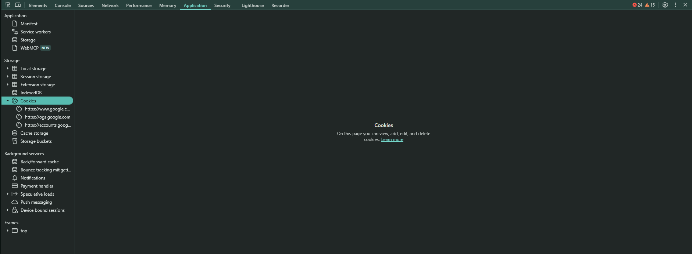
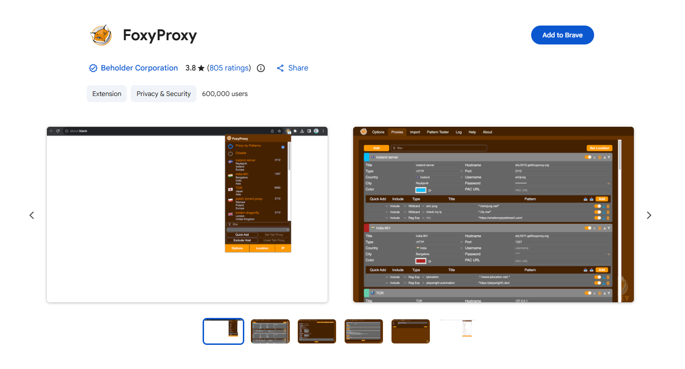
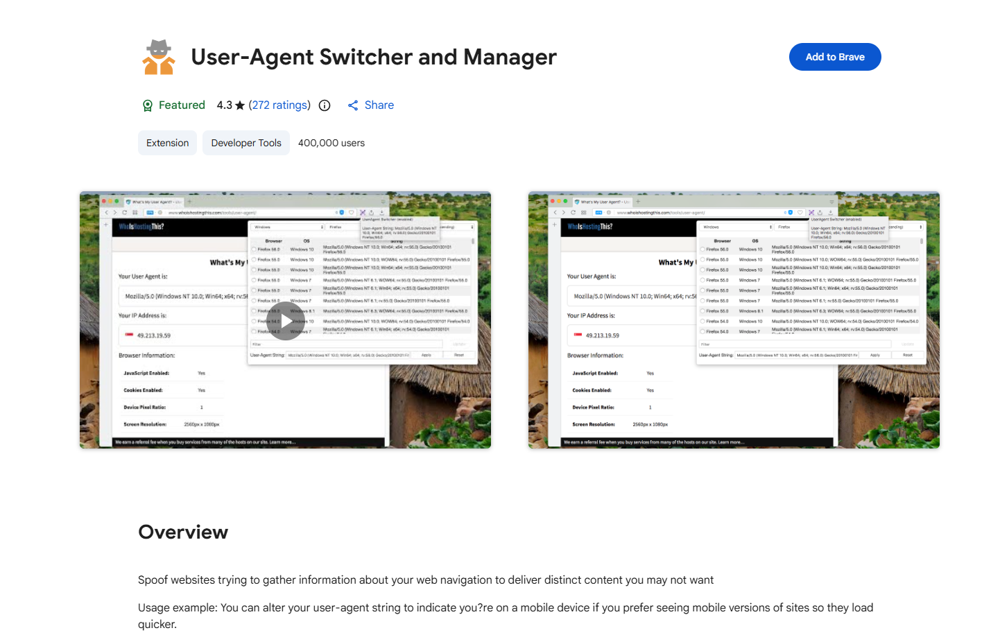
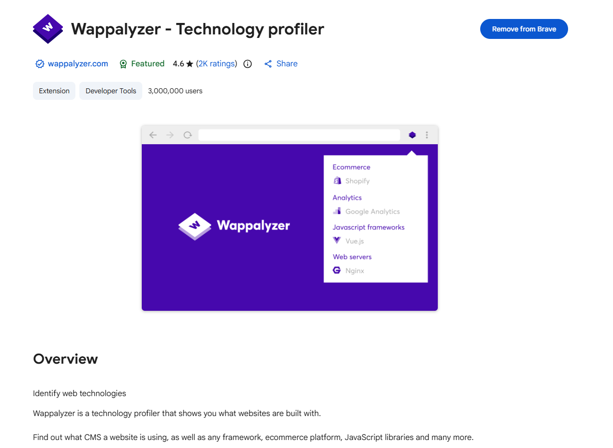

**Active Reconnaissance** is the process of directly probing a target network or system to gather technical intelligence. Unlike passive reconnaissance, which relies on public sources without sending traffic to the target, active methods send packets, make connections, and query services directly.


Active probes leave traces in access logs, firewall rules, Intrusion Detection Systems (IDS), Web Application Firewalls (WAF), and SIEM logs.


> **Legal Requirement:** Never perform active reconnaissance without explicit, signed authorization (such as a formal penetration testing contract or defined bug bounty scope). Unsanctioned probing is illegal.


### **1. Web Browsers & Developer Tools**

A standard web browser is an effective active reconnaissance tool because its traffic naturally blends in with legitimate user activity.




#### **Transport Protocols & Ports**

- **HTTP:** TCP Port 80 (mostly automatically redirects to HTTPS)
    
      
    
- **HTTPS:** TCP Port 443 (standard for encrypted web traffic)
    
      
    
- **HTTP/3:** UDP Port 443 via QUIC (combines TCP and TLS functions for lower latency; marked as `h3` in browser dev tools)
    
      
    
- **Non-Standard Ports:** Specified directly in the URL (e.g., `[https://target.com:8443/](https://target.com:8443/)`)
    
      
    

#### **Developer Tools Key Tabs**

Access via `Ctrl + Shift + I` (Windows/Linux) or `Option + Command + I` (macOS).

  

- **Network:** Shows real-time requests/responses, status codes, cookies, timing data, and headers (such as `Server`, `X-Powered-By`, and `Content-Security-Policy`).
    
      
    
- **Console:** Executes inline JavaScript, shows errors, and exposes DOM details.
    
      
    
- **Sources:** Allows inspection of loaded JS, CSS, and HTML files. JavaScript source code frequently leaks internal API endpoints, directory structures, developer comments, and hardcoded variables.
    
      
    
- **Application / Storage:** Displays cookies, Local Storage, and Session Storage contents, which may expose session tokens or API keys.
    
      
    
- **Security:** Displays TLS/SSL certificate details, including Subject Alternative Names (SANs) that can reveal related subdomains or domains owned by the organization.
    
      
    

#### **Useful Browser Extensions**

- **FoxyProxy:** Manages and switches proxy settings for routing traffic through tools like Burp Suite or OWASP ZAP.
    
    
    
- **User-Agent Switcher:** Changes the request `User-Agent` string to emulate different browsers, mobile devices, or OS footprints.
    
    
    
- **Wappalyzer / BuiltWith:** Automatically identifies technologies used on a web application (CMS platforms, frameworks, server types, databases).
    
    
    

### **2. Network Host Discovery (Ping & ICMP)**

`ping` uses the Internet Control Message Protocol (ICMP) to verify host reachability. It sends an ICMP Echo Request (Type 8) and waits for an ICMP Echo Reply (Type 0).

  

#### **Usage Examples**


```bash
# Send 5 ICMP echo requests on Linux/macOS
ping -c 5 192.168.1.1

# Send 5 ICMP echo requests on Windows
ping -n 5 192.168.1.1

# Force IPv4 or IPv6
ping -4 -c 5 192.168.1.1
ping -6 -c 5 2001:db8::1
```

#### **OS Identification via TTL (Time To Live)**

Every packet starts with a default TTL set by the operating system. Each router along the path decrements this value by 1.

  

- **Linux / Unix default starting TTL:** 64
    
      
    
- **Windows default starting TTL:** 128
    
      
    

_Example:_ Receiving an ICMP reply with `ttl=58` generally indicates a Linux host that is 6 router hops away ($64 - 6 = 58$).

  

#### **Interpreting Results**

|**Result**|**Likely Cause**|**Next Step**|
|---|---|---|
|**0% packet loss**|Host is active and ICMP is permitted|Proceed to service scanning|
|**Destination Host Unreachable**|Target is offline, or no routing path exists|Verify IP address and local routing|
|**100% packet loss (no error)**|ICMP is filtered by a firewall/WAF or host is down|Try TCP/UDP discovery using Nmap|

### **3. Network Path Analysis (Traceroute & MTR)**

Traceroute identifies intermediate routers (hops) between the source and target by sending packets with incrementally increasing TTL values (starting at 1). When a packet's TTL hits 0, the router drops it and returns an `ICMP Time-to-Live Exceeded` message to the sender.

  

#### **Usage Examples**

```bash
# Standard traceroute (Linux/macOS default: UDP)
traceroute 192.168.1.1

# Windows equivalent (uses ICMP)
tracert 192.168.1.1

# TCP mode (bypasses UDP filters)
traceroute -T 192.168.1.1

# ICMP mode
traceroute -I 192.168.1.1

# Real-time combined traceroute + ping statistics
mtr 192.168.1.1
```

_Note:_ Asterisks (`*`) in traceroute output indicate that an intermediate router dropped the packet or chose to suppress ICMP responses. Dynamic routing, CDNs (e.g., Cloudflare, Akamai), and load balancers can cause consecutive traceroute runs to display different path results.

  

### **4. Banner Grabbing & Service Interrogation**

Banner grabbing is the practice of establishing a connection to an open port to read the initialization message ("banner") sent by the service, which often discloses software titles and exact version numbers.

  

#### **Telnet (Legacy)**

Telnet connects over plain TCP (default Port 23) but sends all data unencrypted. While deprecated for management, it can manually connect to open TCP ports to query cleartext services.

  

```bash
# Connect to HTTP on port 80 using Telnet
telnet 192.168.1.1 80

# Manual HTTP request (Type request and press Enter twice):
GET / HTTP/1.1
Host: target.local
```

#### **Netcat (`nc`)**

Netcat is a versatile networking utility capable of reading from and writing to raw network connections over TCP or UDP.

  


```bash
# Banner grabbing via Netcat
nc 192.168.1.1 80
GET / HTTP/1.1
Host: target.local

# Listen mode: Set up a TCP listener on port 4444
nc -lvnp 4444

# IPv6 client connection
nc -6 2001:db8::1 80
```

_Netcat Listener Flags:_

  

- `-l` Listen mode
    
      
    
- `-v` Verbose output
    
      
    
- `-n` Skip DNS resolution
    
      
    
- `-p` Port number specification
    
      
    

#### **Handling Encrypted Services (TLS/SSL)**

Telnet and standard Netcat cannot interpret encrypted protocols (such as HTTPS or SMTPS). Use tools designed for TLS channels to perform banner grabbing on encrypted ports:


```bash
# Fetch HTTP response headers over TLS using curl
curl -I https://192.168.1.1

# Connect to an encrypted service via OpenSSL
openssl s_client -connect 192.168.1.1:443

# Connect using Nmap's upgraded Netcat (ncat) with SSL support
ncat --ssl 192.168.1.1 443
```

### **Quick Command Reference**

|**Task**|**Tool**|**Command Syntax**|
|---|---|---|
|Ping Host (Linux)|`ping`|`ping -c 4 <IP>`|
|Ping Host (Windows)|`ping`|`ping -n 4 <IP>`|
|Trace Path (Linux)|`traceroute`|`traceroute <IP>`|
|Trace Path (Windows)|`tracert`|`tracert <IP>`|
|Trace Path via TCP|`traceroute`|`traceroute -T <IP>`|
|Live Path Diagnostics|`mtr`|`mtr <IP>`|
|Interrogate Port|`nc`|`nc <IP> <PORT>`|
|Listen on Port|`nc`|`nc -lvnp <PORT>`|
|TLS Banner Grab|`curl`|`curl -I https://<IP>`|
|Interactive TLS|`openssl`|`openssl s_client -connect <IP>:<PORT>`|