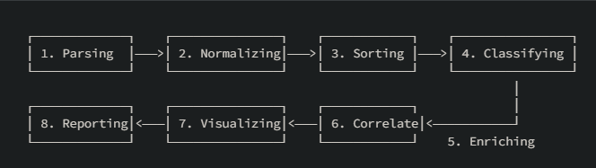

System activity and security events leave digital records known as logs. Log analysis allows security teams to identify network breaches, track malicious actions, and reconstruct the complete sequence of an incident.


  

**Key Information Contained in Log Entries** A standard log entry contains several foundational attributes:

  

- **Timestamp**: Exact date and time the event occurred.
    
      
    
- **Source/Identifier**: System name, application, or service generating the record.
    
      
    
- **Event Details**: Type of action (e.g., login attempt, file access, error) along with associated context like user IDs or IP addresses.
    
      
    

**Common Log Types** Different log sources offer visibility into specific system operations:

  

- **System & Server Logs**: Record kernel events, boot processes, hardware status, and overall server performance.
    
      
    
- **Security & Audit Logs**: Capture authentication attempts, permission changes, firewall alerts, and compliance activities.
    
      
    
- **Application & Web Server Logs**: Document web traffic, API requests, URLs, HTTP status codes, and application errors.
    
      
    
- **Network & Database Logs**: Track connections, traffic movement, database queries, and data updates.
    
      
    

**Log Data Formats** Logs are typically structured in one of three ways:

  

- **Structured**: Strict, machine-readable formats ideal for automated parsing (e.g., JSON, CSV, TSV, XML, W3C Extended Log Format).
    
      
    
- **Semi-Structured**: A mix of standardized parameters and free-form text (e.g., Syslog, Windows Event Log / EVTX).
    
      
    
- **Unstructured**: Free-form text fields that require custom parsing rules (e.g., NCSA Common Log Format, NCSA Combined Log Format).
    
      
    

**Industry Log Standards** Standard guidelines dictate how logs should be created, stored, and secured:

  

- [MITRE CEE (Common Event Expression)](https://cee.mitre.org/): Standardizes log structure for cross-platform analysis.
    
      
    
- [OWASP Logging Cheat Sheet](https://cheatsheetseries.owasp.org/cheatsheets/Logging_Cheat_Sheet.html): Guidelines for developers on implementing security-focused logging.
    
      
    
- [NIST SP 800-92](https://csrc.nist.gov/publications/detail/sp/800-92/final): Comprehensive guidelines for computer security log management.
    
      
    
- Cloud-native logging documentation: [Google Cloud Logging Guidelines](https://cloud.google.com/logging/docs) and [Azure Monitor Logs](https://learn.microsoft.com/en-us/azure/azure-monitor/logs/data-platform-logs).
    
      
    

## Log Lifecycle Management

  

**1. Time Synchronization** Accurate logs depend on precise timing. Systems must use Network Time Protocol (NTP) to align clocks across all devices so event sequences line up correctly.

  


```bash
# Sync system time using NTP on Linux
sudo ntpdate pool.ntp.org
```

**2. Centralization & Storage Tiers** Logs should be forwarded to central platforms like Splunk or the Elastic Stack (ELK). Storage is divided into three tiers to manage capacity and cost:

  

- **Hot Storage**: Immediate access for active data (recent 3–6 months).
    
      
    
- **Warm Storage**: Moderately fast retrieval for operational queries (6–24 months).
    
      
    
- **Cold Storage**: Compressed archive for compliance and long-term investigation (2–5+ years).
    
      
    

**3. Automated Log Rotation (`logrotate`)** To prevent disk storage exhaustion, log management utilities automatically rotate, compress, and hash log files.

  

Configuration file example (`/etc/logrotate.d/websrv-sshd.conf`):

  

```bash
/var/log/websrv-02/rsyslog_sshd.log {
    daily
    rotate 30
    compress
    lastaction
        DATE=$(date +"%Y-%m-%d")
        echo "$(date)" >> "/var/log/websrv-02/hashes_${DATE}_sshd.txt"
        for i in $(seq 1 30); do
            FILE="/var/log/websrv-02/rsyslog_sshd.log.$i.gz"
            if [ -f "$FILE" ]; then
                HASH=$(/usr/bin/sha256sum "$FILE" | awk '{print $1}')
                echo "rsyslog_sshd.log.$i.gz $HASH" >> "/var/log/websrv-02/hashes_${DATE}_sshd.txt"
            fi
        done
        systemctl restart rsyslog
    endscript
}
```

## The Log Analysis Process

  

Log analysis moves through eight clear stages:

  

1. **Parsing**: Extracting key elements (IPs, dates, status codes) from raw text.
    
      
    
2. **Normalization**: Converting logs from different tools into a single standard layout.
    
      
    
3. **Sorting**: Ordering events by time or severity.
    
      
    
4. **Classification**: Labeling entries by event type, source, or priority.
    
      
    
5. **Enrichment**: Adding external context (such as threat intelligence or IP geographic locations).
    
      
    
6. **Correlation**: Linking related actions across different devices to uncover attack chains.
    
      
    
7. **Visualization**: Graphing data using dashboards to spot anomalies faster.
    
      
    
8. **Reporting**: Summarizing findings for leadership, technical teams, or regulatory compliance.
    
      
    

## Log Processing Command Line Cheat Sheet

  

When SIEM systems are unavailable, native Linux utilities process and consolidate log files directly:


```bash
# Extract and normalize timestamps from access logs into a consolidated file
awk -F'[][]' '{print "["$2"]", "/var/log/gitlab/nginx/access.log ---", "\""$0"\""}' /var/log/gitlab/nginx/access.log > /tmp/parsed_consolidated.log

# Search for specific malicious activity or IP addresses
grep "34.253.159.159" /tmp/parsed_consolidated.log > /tmp/filtered_consolidated.log

# Sort logs chronologically and remove duplicate entries
sort /tmp/parsed_consolidated.log > /tmp/sorted.log
uniq /tmp/sorted.log /tmp/final_consolidated.log

# Verify log file integrity using cryptographic hashing
sha256sum /tmp/final_consolidated.log
```

## Detecting and Responding to an Insider Breach*

  

**Target Environment**: Financial services organization (SwiftSpend Financial) operating an internal GitLab source-code repository and web infrastructure.

  

### Phase 1: Incident Trigger & Initial Discovery

A security analyst reviewing automated daily reports notices an unusual spike in outbound data traffic originating from an internal developer host (`10.10.133.168`) late at night. The host accessed the internal code repository `gitlab.swiftspend.finance` outside of business hours.

  

### Phase 2: Log Collection & Centralization

Because the organization centralizes system events via `rsyslog` and maintains time synchronization across all servers using Network Time Protocol (NTP), logs from the web proxy, operating systems, and applications are aligned across a single timeline.

  

The incident response team extracts raw logs from multiple sources to analyze the activity:

  

- **Network & Web Proxy Logs**: Track inbound/outbound IP addresses and connection requests.
    
      
    
- **Web Server Logs (Nginx / NCSA Combined Format)**: Capture user HTTP requests, endpoints visited, and client User-Agent strings.
    
      
    
- **Application Logs (GitLab Rails API)**: Document user account actions, API token usage, and project accesses.
    
      
    
- **System Logs (`/var/log/syslog` & `sshd`)**: Record local user authentication attempts and elevated privileges.
    
      
    

To ensure the evidence remains legally admissible, the analyst generates a SHA-256 cryptographic hash of the raw log files immediately upon collection.

  

### Phase 3: Applying the 8-Stage Log Processing Pipeline

To transform millions of unorganized, raw lines of text into actionable insights, the analyst processes the data through the core log analysis pipeline:

  


1. **Parsing**: Breaking raw log entries into individual data fields.
    
      
    - _Raw Nginx Entry_:
        
          
        
        `34.253.159.159 adversary [08/Sep/2023:22:10:00 +0000] "GET /gitlab-instance-2fdab3a4/pat-api-key HTTP/1.1" 200 4886`
        
          
        
          
        
    - _Parsed Attributes_: `Client IP: 34.253.159.159`, `User: adversary`, `Timestamp: 08/Sep/2023:22:10:00`, `URI: /gitlab-instance-2fdab3a4/pat-api-key`, `Status Code: 200`.
        
          
        
2. **Normalization**: Standardizing varying timestamp formats across sources (converting local Syslog dates and W3C web dates into a unified ISO standard format).
    
      
    
3. **Sorting**: Ordering all entries chronologically across the Nginx, GitLab API, and Syslog datasets to build a clear, step-by-step timeline of events.
    
      
    
4. **Classification**: Categorizing log entries by event type and priority level:
    
      
    - HTTP `GET` requests to public pages $\rightarrow$ _Low Severity / Informational_.
        
          
        
    - Unauthenticated API calls accessing credential repositories $\rightarrow$ _High Severity / Security Event_.
        
          
        
5. **Enrichment**: Adding contextual data to raw identifiers.
    
      
    - The client IP `34.253.159.159` is flagged by threat intelligence tools as an external VPN endpoint.
        
          
        
    - Device fingerprinting maps the internal host `10.10.133.168` to an Ubuntu endpoint running a specific browser (`Mozilla/5.0 (X11; Ubuntu; Linux x86_64; rv:109.0) Gecko/20100101 Firefox/115.0`).
        
          
        
6. **Correlation**: Connecting separate events from different log files to identify the attack path:
    
      
    - _Link 1_: User `adversary` authenticated from IP `34.253.159.159` at 22:10.
        
          
        
    - _Link 2_: The user queried a repository named `pat-api-key` and received an HTTP `200` success response containing an exposed API key.
        
          
        
    - _Link 3_: Minutes later, the web proxy showed continuous requests from the same user session maintaining access via a web shell on `gitlab.swiftspend.finance`.
        
          
        
7. **Visualization**: Graphing request counts and bandwidth usage over time to highlight the traffic spike during off-hours.
    
      
    
8. **Reporting**: Generating a summary report for management detailing the scope, timeline, compromised assets, and root cause.
    
      
    

### Phase 4: Reconstructing the Incident Timeline

By processing the logs, the incident response team answers the core investigation questions:

  

| **Security Question**          | **Findings from Log Analysis**                                                                                                       |
| ------------------------------ | ------------------------------------------------------------------------------------------------------------------------------------ |
| **What happened?**             | An external adversary accessed SwiftSpend Financial's internal GitLab instance and exposed sensitive system credentials.             |
| **When did it happen?**        | Unauthorized access began at 22:10 on Wednesday, September 8th.                                                                      |
| **Where did it originate?**    | The connection originated from IP `10.10.133.168` assigned to the internal VPN network segment (`10.10.133.0/24`).                   |
| **Who was responsible?**       | User account `adversary` using a Linux Firefox browser (`Mozilla/5.0... Firefox/115.0`).                                             |
| **Was the attack successful?** | Yes. An API key exposed in the codebase was accessed, allowing the attacker to establish a web shell on `gitlab.swiftspend.finance`. |
| **What was the impact?**       | The adversary achieved remote code execution on the GitLab server and executed post-exploitation actions.                            |

### Phase 5: Remediation & Post-Incident Action Plan

1. **Immediate Isolation**: Revoke the compromised API key, disconnect host `10.10.133.168` from the network, and kill active web shell sessions on the web server.
    
      
    
2. **Log Maintenance**: Configure `logrotate` to compress, rotate, and archive the investigation logs to cold storage for long-term retention and legal protection.
    
      
    
3. **Hardening**: Implement automated secret-scanning tools in code repositories to prevent API keys from being committed in cleartext.