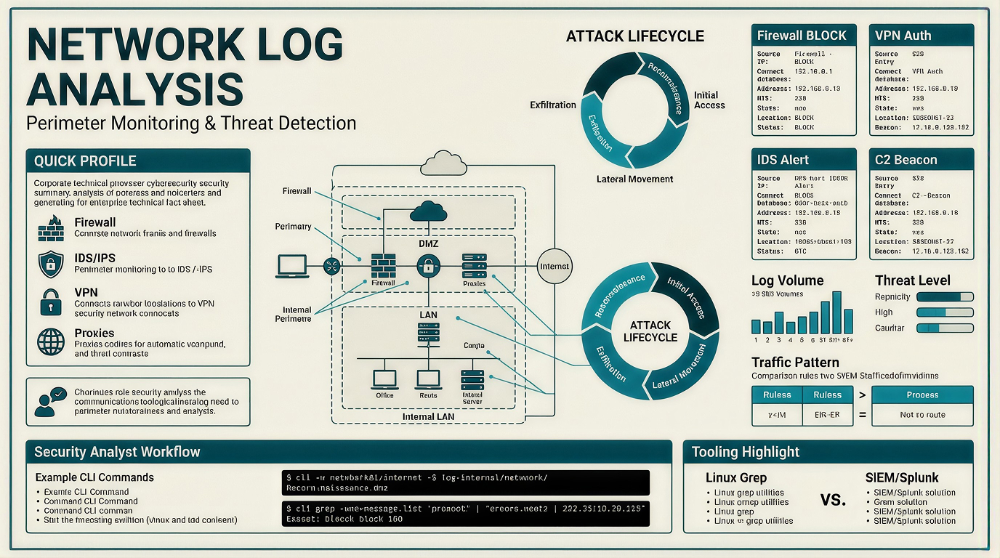
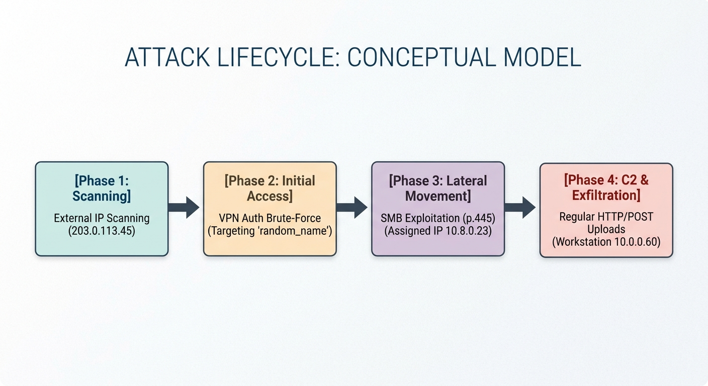

Network-centric security monitoring relies on analyzing traffic between hosts across system boundaries. Combining host logs (internal activity) with network logs (perimeter movement) provides full visibility to identify attack vectors and build incident timelines.



## Overview & Core Concepts

  

- **Network Perimeter**: The boundary separating trusted internal networks (Active Directory, file servers, workstations) from untrusted external networks (the internet).
    
      
    
- **Log Correlation**: Cross-referencing firewall, IDS/IPS, and authentication logs to trace an attack from initial access through exfiltration.
    
      
    

## Key Log Sources

  

- **Firewalls**: Log allowed/blocked connections based on IP, port, and security rules. First line of defense for edge exposure.
    
      
    
- **IDS/IPS (Intrusion Detection/Prevention Systems)**: Analyze traffic against signatures or behavioral anomalies to detect active exploits.
    
      
    
- **Web Application Firewalls (WAF)**: Monitor application-layer HTTP/HTTPS traffic to block web attacks (SQLi, XSS, Directory Traversal).
    
      
    
- **VPN Gateways**: Record authentication attempts, source IPs, timestamp data, and assigned internal IPs for remote connections.
    
      
    
- **Flow Data (Routers/Switches)**: Provide summary statistics on communications (endpoints, duration, traffic volume).
    
      
    

## Network Perimeter Architecture

The network perimeter divides trusted internal assets from untrusted external networks.

- **Firewalls:** Filter traffic between internal and external networks.
- **DMZ (Demilitarized Zone):** Isolates public-accessible services (web, mail) from internal networks.
- **VPN Gateways:** Secure external connection pathways for remote workers.

## Practical Analysis & Investigation Techniques

  

**1. Log Analysis Tools & Indexing** SOC Analysts can analyze raw log files using Linux command-line utilities (`grep`, `cut`, `sort`, `uniq`) or ingest them into a SIEM like Splunk.

  

- **Splunk Search Target**: `index="network_logs"`
    
      
    
      
    
- **Sourcetypes**: `firewall_logs`, `ids_logs`, `vpn_logs`
    
      
    
      
    

**2. CLI Command Examples & Detection Workflows**

  

- **Identify Top Blocked IPs (Reconnaissance Detection)**
    
      

    
    ```bash
    # Filter blocked traffic, parse source IPs, count and sort unique occurrences
    cat firewall.log | grep "BLOCK" | cut -d' ' -f5 | cut -d: -f1 | sort -nr | uniq -c
    ```
    
- **Detect VPN Brute-Force Attempts (Credential Access)**
    

    
    ```bash
    # Identify IP addresses with the highest count of failed authentication attempts
    cat vpn_auth.log | grep "FAIL" | cut -d' ' -f3 | sort -nr | uniq -c
    ```
    
- **Trace Lateral Movement via Internal Exploits**
    

    
    ```bash
    # Search IDS logs for internal IP activity matching lateral movement exploits (e.g., SMB/RDP/SSH)
    cat ids_alerts.log | grep "<INTERNAL_IP>" | grep 'SMB' | cut -d' ' -f6,7,8,9,10,19,21
    ```
    
- **Detect C2 Beaconing & Data Exfiltration**
    

    
    ```bash
    # Identify high-frequency or regular outbound C2 alerts and large HTTP POST transfers
    cat ids_alerts.log | grep -n "<SUSPICIOUS_IP>" | sort -nr | uniq -c
    ```
    


  

## Traffic Behavior Patterns

  

|**Pattern**|**Observed Behavior**|**Primary Threat Category**|
|---|---|---|
|**One Source $\rightarrow$ Multiple Ports / Destinations**|Sequential or rapid connection attempts across range of ports|Reconnaissance / Port Scan|
|**One Source $\rightarrow$ Single Destination (High Volume)**|Repeated failed login attempts on SSH, RDP, or VPN services|Brute-Force Attack|
|**Regular Fixed Intervals**|Continuous external outbound connections on specific ports|Malware C2 Beaconing|
|**Large Outbound Web Requests**|High-frequency or unusually large HTTP POST connections|Data Exfiltration|

# Case Study: Enterprise Intrusion & Incident Timeline (Initech Corp)

  

## Incident Summary

A security analysis of perimeter logs at Initech Corp revealed a multi-stage cyber intrusion. An external adversary moved from initial reconnaissance to credential compromise, internal exploitation, C2 persistence, and data exfiltration.


## Incident Timeline & Log Breakdown



**Phase 1: External Reconnaissance & Port Scanning**

  

- **Observed Activity:** External IP `203.0.113.45` attempted connections across multiple high-risk ports (`21`, `22`, `23`, `445`).
    
      
    
- **Target System:** Financial Server `10.0.0.20` (FINANCE-SRV1).
    
      
    
- **Log Findings:** Firewall blocked over 270 unauthorized probing attempts.
    
      
    
- **CLI Analysis Command:**
    
      
    
    Bash
    
    ```
    cat firewall.log | grep "BLOCK" | cut -d' ' -f5 | cut -d: -f1 | sort | uniq -c | sort -nr
    ```
    
    _(Identifies the top external source IP responsible for dropped firewall connections)_.
    
      
    

**Phase 2: Credential Access via VPN Gateway**

  

- **Observed Activity:** The adversary pivoted to brute-forcing the remote access gateway (`10.0.0.50`).
    
      
    
- **Target Account:** `svc_backup`.
    
      
    
- **Outcome:** Following repeated `FAIL_AUTH` events, a successful authentication was logged.
    
      
    
- **Compromise Indicator:** The attacker was assigned an internal VPN IP address (`10.8.0.23`).
    
      
    
- **CLI Analysis Command:**
    
      
    
    Bash
    
    ```
    cat vpn_auth.log | grep "FAIL" | cut -d' ' -f3 | sort -nr | uniq -c
    ```
    
    _(Isolates IPs performing brute-force authentication attacks against the VPN)_.
    
      
    

**Phase 3: Internal Lateral Movement**

  

- **Observed Activity:** Operating from internal IP `10.8.0.23`, the attacker scanned neighboring subnets for exploitable services.
    
      
    
- **Vector:** Exploited vulnerable Server Message Block (SMB) protocols over port `445`.
    
      
    
- **Affected Assets:** Application Server `10.0.0.51` and Workstation `10.0.0.60`.
    
      
    
- **Log Findings:** IDS alerts triggered signature `ET EXPLOIT Possible MS-SMB Lateral Movement`.
    
      
    
- **CLI Analysis Command:**
    
      

    
    ```bash
    cat ids_alerts.log | grep "10.8.0.23" | grep "SMB" | cut -d' ' -f6,7,8,9,10,19,21
    ```
    
    _(Extracts specific lateral movement exploit alerts associated with the compromised VPN lease)_.
    
      
    

**Phase 4: Persistence (C2) & Data Exfiltration**

  

- **Observed Activity:** Compromised internal Workstation `10.0.0.60` established persistent command-and-control communication with an external server on port `4444`.
    
      
    
- **Exfiltration Vector:** Outbound HTTP POST requests transferred large data payloads off-site via web ports `80` and `8080`.
    
      
    
- **CLI Analysis Command:**
    
      
    

    
    ```bash
    cat ids_alerts.log | grep "10.0.0.60" | grep -E "C2 Beaconing|Large Upload"
    ```
    
    _(Correlates automated host beaconing with suspicious outbound data transfer alerts)_.
    
      
    

## Key Takeaways for SOC Analysts

- **Correlate Across Datasets:** Individual events (such as a single successful VPN login) appear normal in isolation. Cross-referencing firewall blocks, authentication failures, and internal IDS alerts reveals the true attack scope.
    
      
    
- **Identify Behavioral Anomalies:**
    
      
    - High failure-to-success ratios indicate credential brute-forcing.
        
          
        
    - Internal-to-internal SMB traffic originating from remote VPN client leases signals lateral movement.
        
          
        
    - Periodic outbound sessions indicate C2 beaconing.